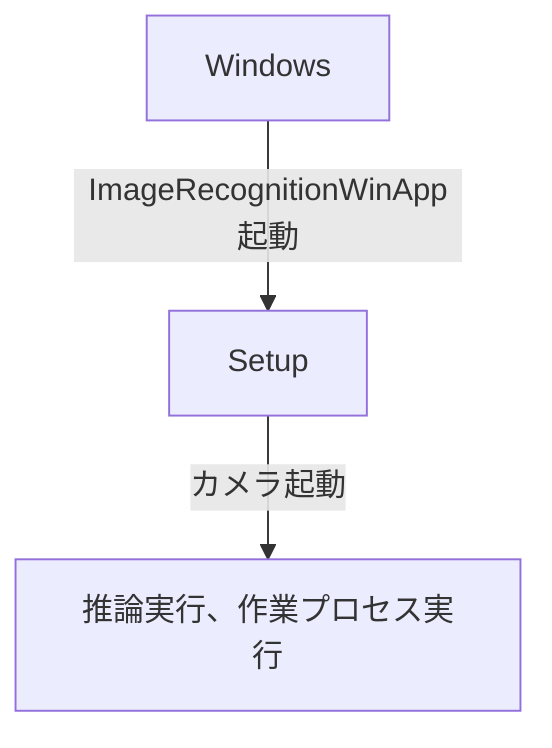

# ImageRecognitionWinApp

## Windowsアプリ側仕様
### 必須機能
- Yolo 7, 8, NASを選択可能に
- カメラ機能呼び出し
- 推論停止

## ユーザーフロー

```mermaid
flowchart TD
  A[Windows] -->|ImageRecognitionWinApp起動| B[Setup];
  B -->|カメラ起動| C[推論実行、作業プロセス実行];
```

## 画面一覧
 - Setup: 推論モデル選択、カメラ起動ボタン等の実行セットアップ画面
 - 
